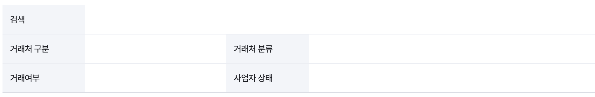
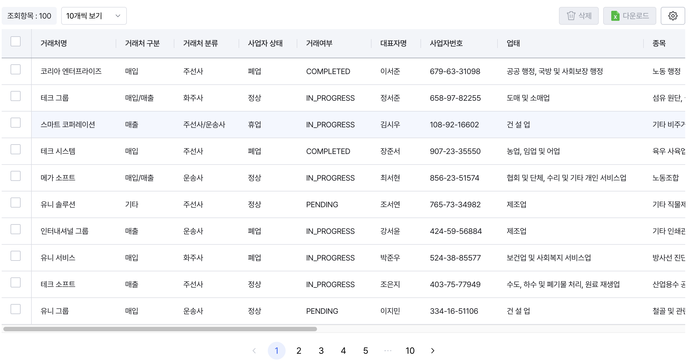
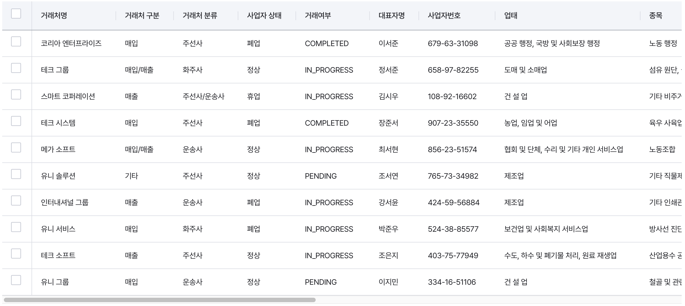

## 주요 UI 컴포넌트

1. **Descriptions**:
   

- label과 content가 포함된 설명 리스트 컴포넌트로, 정보를 구조화하여 표시합니다.
- 상위 컨테이너와 Row, Item으로 구성되며 주로 상세 정보를 표시할 때나 폼 형식의 ui를 구성할 때 사용됩니다.

2. **TableBase**:
   

- 테이블 관련 UI 요소들의 컨테이너 역할을 하는 컴포넌트로, 툴바와 페이지네이션 요소를 포함합니다.
- Toolbar와 Pagination을 sub component로 제공하여 일관된 테이블 레이아웃을 구성할 수 있습니다.

3. **MainTable**:
   

- @tanstack/react-table 기반의 고급 테이블 컴포넌트로, 정렬, 행 선택, 컬럼 크기 조정, 고정 열 등 다양한 기능을 지원합니다.
- 콘텐츠 기반 자동 컬럼 크기 계산, 로딩 상태 표시, 빈 데이터 처리 등 실전적인 UX 기능을 내장하고 있습니다.
